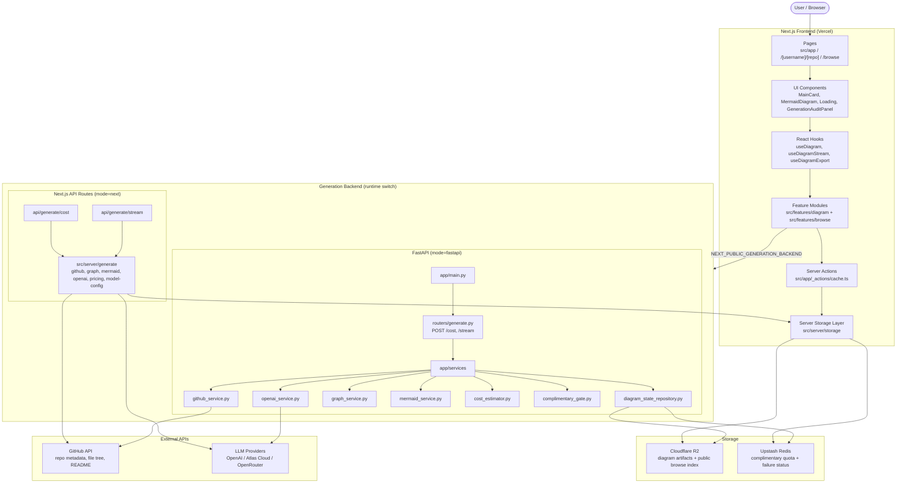

# GitDiagram Architecture

## Overview

GitDiagram turns any GitHub repository into an interactive Mermaid architecture diagram. The system is split into a **Next.js frontend**, a **switchable generation backend** (Next.js API routes or FastAPI), **external APIs** (GitHub + LLM providers), and a **storage layer** (Cloudflare R2 + Upstash Redis).

## Container / Component Diagram

## Component Descriptions

### Next.js Frontend

| Component | Responsibility |
|-----------|----------------|
| `src/app` | App Router pages: home, repo diagram page (`/[username]/[repo]`), browse catalog, sponsor page, OG/Twitter images. |
| `src/components` | React UI: `MainCard` (repo URL input), `MermaidDiagram` (pan/zoom rendering), `Loading` (stream progress), `GenerationAuditPanel` (error audits). |
| `src/hooks` | State management: `useDiagram` orchestrates cache vs generation, `useDiagramStream` consumes SSE messages, `useDiagramExport` handles copy/image export. |
| `src/features/diagram` | Domain logic: API client, GitHub URL parsing, SSE parsing, shared types, graph schema. |
| `src/features/browse` | Browse catalog logic and pagination. |
| `src/app/_actions/cache.ts` | Server actions that fetch/record diagram state from storage. |
| `src/server/storage` | Storage abstraction over Cloudflare R2 and Upstash Redis. |

### Generation Backend

The frontend can target **one of two** interchangeable backends via `NEXT_PUBLIC_GENERATION_BACKEND`:

#### Option A: Next.js API Routes (`mode=next`)

| Component | Responsibility |
|-----------|----------------|
| `api/generate/cost` | Estimates generation cost before streaming. |
| `api/generate/stream` | Streams SSE generation events to the browser. |
| `src/server/generate` | Same pipeline as FastAPI: GitHub fetch, LLM explanation, graph generation, Mermaid compile, persistence. |

#### Option B: FastAPI (`mode=fastapi`)

| Component | Responsibility |
|-----------|----------------|
| `app/main.py` | FastAPI entry point with CORS and API analytics middleware. |
| `routers/generate.py` | `/generate/cost` and `/generate/stream` endpoints. |
| `github_service.py` | Fetches repo metadata, file tree, and README from GitHub. |
| `openai_service.py` | Streams explanation and generates structured graph output via LLM. |
| `graph_service.py` | Validates the structured graph against the file tree and compiles it to Mermaid. |
| `mermaid_service.py` | Validates final Mermaid syntax. |
| `cost_estimator.py` | Estimates input/output tokens and cost. |
| `complimentary_gate.py` | Manages free daily token quota. |
| `diagram_state_repository.py` | Persists artifacts to R2 and quota/failure status to Redis. |

### Storage

| Store | Technology | Purpose |
|-------|------------|---------|
| Artifact Store | Cloudflare R2 | Stores generated diagram, explanation, graph, and session audit per repo. |
| Browse Index | Cloudflare R2 | Public `browse-index.json` listing recently generated public diagrams. |
| Quota / Status | Upstash Redis | Tracks complimentary token quota and transient failure summaries. |

### External APIs

| API | Purpose |
|-----|---------|
| GitHub API | Repo metadata, recursive file tree, README content. |
| OpenAI / Atlas Cloud / OpenRouter | Explanation generation and structured graph generation. |

## Data Flow

1. **User submits a repo URL** in `MainCard`.
2. **Frontend checks cache** via `useDiagram` -> server action `cache.ts` -> `src/server/storage`.
3. **Cache hit**: the stored Mermaid diagram renders immediately in `MermaidDiagram`.
4. **Cache miss**: `useDiagramStream` opens an SSE stream against the configured backend (`/generate/stream`).
5. **Backend fetches GitHub data**: default branch, file tree, README via `github_service.py` / `src/server/generate/github.ts`.
6. **Cost estimation** runs; complimentary-quota gate checks token budget.
7. **LLM explanation**: stream the model's analysis of the repo structure.
8. **LLM graph generation**: request a structured graph (nodes/edges/groups), retry up to 3 times if validation fails.
9. **Mermaid compilation**: `graph_service` / `src/server/generate/graph.ts` compiles the graph into Mermaid syntax.
10. **Mermaid validation**: `mermaid_service` / `src/server/generate/mermaid.ts` parses the result.
11. **Persistence**: successful diagrams are written to R2; the public browse index is updated; session audits and failures go to Redis/R2.
12. **Browser rendering**: `MermaidDiagram` renders the SVG, with pan/zoom interaction.

## Files

- Mermaid source: [`architecture.mmd`](./architecture.mmd)
- Markdown document: [`architecture.md`](./architecture.md)
