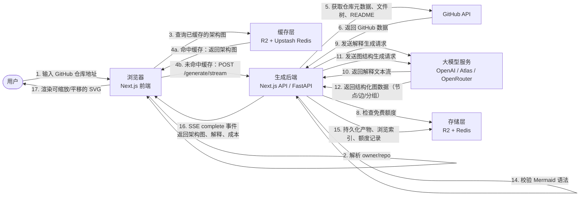
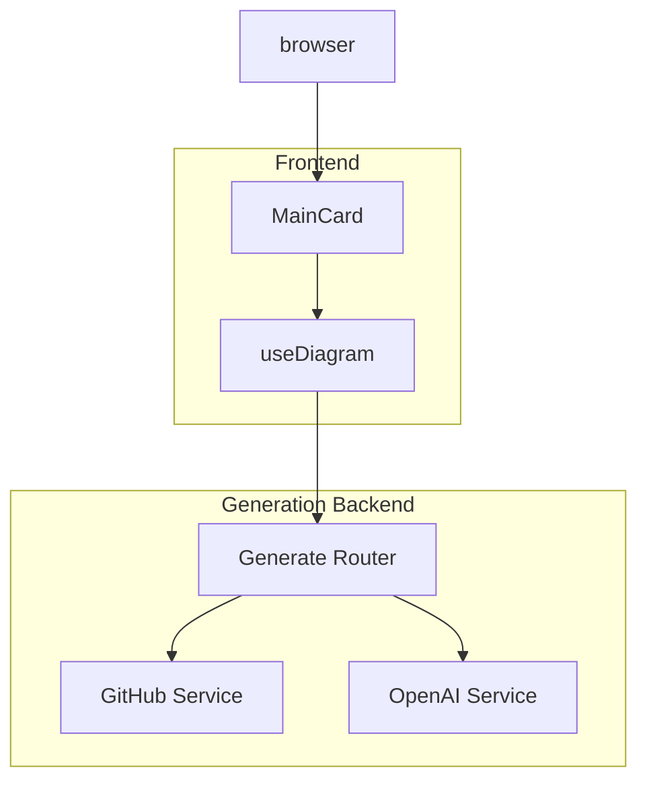

# GitDiagram 数据流

当用户在 GitDiagram 中输入一个 GitHub 仓库地址时，系统会经过以下数据流将其转换为可交互的架构图。

## 时序图



## 分步数据流

| 步骤 | 参与者 | 动作 | 关键文件 |
|------|--------|------|----------|
| 1 | 用户 | 在 `MainCard` 中输入 GitHub 仓库地址。 | [`src/components/main-card.tsx`](../src/components/main-card.tsx) |
| 2 | 浏览器 | 将 URL 解析为 `owner/repo`，并跳转到 `/{username}/{repo}`。 | [`src/features/diagram/github-url.ts`](../src/features/diagram/github-url.ts) |
| 3 | 浏览器 | 检查该仓库是否已有缓存的架构图。 | [`src/hooks/useDiagram.ts`](../src/hooks/useDiagram.ts) |
| 4a | 缓存 | 如果 R2 中已存在产物，直接返回缓存的 Mermaid 图。 | [`src/server/storage/diagram-state.ts`](../src/server/storage/diagram-state.ts) |
| 4b | 浏览器 | 打开 SSE 流，向配置的生成后端请求新的架构图。 | [`src/hooks/diagram/useDiagramStream.ts`](../src/hooks/diagram/useDiagramStream.ts) |
| 5 | 后端 | 从 GitHub 获取仓库元数据、递归文件树和 README。 | [`backend/app/services/github_service.py`](../backend/app/services/github_service.py)、[`src/server/generate/github.ts`](../src/server/generate/github.ts) |
| 6 | GitHub | 返回默认分支、文件路径、README 内容、是否私有、Star 数。 | GitHub REST API |
| 7 | 后端 | 估算输入/输出 Token 数与生成成本。 | [`backend/app/services/cost_estimator.py`](../backend/app/services/cost_estimator.py) |
| 8 | 后端 | 如果启用免费额度且未提供 API Key，则预留每日 Token 配额。 | [`backend/app/services/complimentary_gate.py`](../backend/app/services/complimentary_gate.py) |
| 9 | 后端 | 将文件树和 README 发送给大模型，请求生成解释。 | [`backend/app/services/openai_service.py`](../backend/app/services/openai_service.py) |
| 10 | 大模型 | 以流式方式返回对仓库结构的自然语言解释。 | `SYSTEM_FIRST_PROMPT` |
| 11 | 后端 | 将解释、文件树和仓库上下文发送给大模型，请求生成图结构。 | [`backend/app/services/openai_service.py`](../backend/app/services/openai_service.py) |
| 12 | 大模型 | 返回结构化的图对象（分组、节点、边）。 | [`src/features/diagram/graph.ts`](../src/features/diagram/graph.ts) |
| 13 | 后端 | 根据真实文件树校验图结构，并将其编译为 Mermaid 语法。若校验失败，最多重试 3 次。 | [`backend/app/services/graph_service.py`](../backend/app/services/graph_service.py) |
| 14 | 后端 | 解析编译后的 Mermaid，确保语法正确。 | [`backend/app/services/mermaid_service.py`](../backend/app/services/mermaid_service.py) |
| 15 | 后端 | 将产物写入 R2，更新公共浏览索引，并记录额度/审计状态。 | [`backend/app/services/diagram_state_repository.py`](../backend/app/services/diagram_state_repository.py) |
| 16 | 后端 | 发送最终的 SSE `complete` 事件，包含架构图、解释、图数据和成本摘要。 | [`backend/app/routers/generate.py`](../backend/app/routers/generate.py) |
| 17 | 浏览器 | 将 Mermaid 字符串渲染为支持缩放和平移的交互式 SVG。 | [`src/components/mermaid-diagram.tsx`](../src/components/mermaid-diagram.tsx) |

## 步骤 9-10 的提示词详情

在步骤 9 中，后端使用 `SYSTEM_FIRST_PROMPT` 作为系统提示词，向大模型请求生成仓库解释。实际发送的用户消息包含 `<file_tree>` 和 `<readme>` 两个标签，内容由 [`backend/app/utils/format_message.py`](../backend/app/utils/format_message.py) 格式化生成。

### 系统提示词（`SYSTEM_FIRST_PROMPT`）

```text
You are a principal software engineer analyzing a repository in order to explain its architecture clearly.

You will receive:
- <file_tree>...</file_tree>
- <readme>...</readme>

Your job is to explain the repository in a way that helps another engineer draw an accurate architecture diagram for any type of project.

Requirements:
- Be concrete and repo-specific.
- Identify the main subsystems, data flows, and important boundaries.
- Mention relevant technologies, runtimes, tooling, infrastructure, or external services only when they materially affect the architecture.
- Keep the explanation concise and high-signal. Prefer 8-16 short sections or paragraphs over a long essay.
- Avoid repeating the same subsystem in multiple ways.
- Avoid Mermaid syntax, JSON, pseudo-code, or implementation instructions.
- Do not assume the project is a web app. It could be any repo type.

Return only:
<explanation>
...
</explanation>
```

### 用户消息示例

```text
<file_tree>
src/app/page.tsx
src/components/main-card.tsx
backend/app/main.py
...
</file_tree>

<readme>
# GitDiagram
Turn any GitHub repository into an interactive architecture diagram.
...
</readme>
```

大模型以流式方式返回被 `<explanation>` 标签包裹的自然语言解释，后端提取该内容后用于步骤 11 的图结构生成。

## 分支路径

### 缓存命中
如果 Cloudflare R2 中已存在该仓库的产物，则完全跳过后端生成流程。前端直接渲染缓存图，并在后台异步刷新缓存状态。

### 失败路径
- **图结构校验失败**：大模型生成图结构后，若与文件树不一致，后端会将反馈发回大模型重试，最多 3 次。
- **Mermaid 编译错误**：后端返回错误 SSE 事件，并将失败摘要持久化到 Redis/R2。
- **浏览器渲染错误**：`MermaidDiagram` 将渲染失败信息通过 `persistDiagramRenderError` 回传给服务端。
- **额度耗尽 / Token 超限**：后端返回错误事件，并可提示用户输入自己的 API Key 继续生成。

## 后端选择

前端通过 `NEXT_PUBLIC_GENERATION_BACKEND` 在运行时选择生成后端：

- `next` — 使用 [`src/app/api/generate/stream/route.ts`](../src/app/api/generate/stream/route.ts)
- `fastapi` — 使用 [`backend/app/routers/generate.py`](../backend/app/routers/generate.py)

两种实现遵循相同的数据流，并共享同一套存储层。

---

# LLM 交互过程详解（步骤 9-13）

本文件拆解 GitDiagram 在生成架构图时与 LLM 的两次主要交互：

1. **解释生成**（步骤 9-10）：让 LLM 理解仓库结构并输出自然语言解释。
2. **图结构生成**（步骤 11-12）：让 LLM 根据解释输出结构化的图数据（节点/边/分组）。
3. **校验与重试**（步骤 13）：后端校验图数据，失败时将反馈回传给 LLM 重试。

---

## 第一次交互：解释生成（步骤 9-10）

### 发送内容

**模型参数**

| 参数 | 值 |
|------|-----|
| 调用方式 | 流式聊天补全（`streamCompletion`） |
| System Prompt | [`SYSTEM_FIRST_PROMPT`](../backend/app/prompts.py) |
| User Prompt | `<file_tree>` + `<readme>` |
| Reasoning Effort | `medium` |
| Max Output Tokens | 由 `EXPLANATION_MAX_OUTPUT_TOKENS` 控制 |

**System Prompt 内容**

```text
You are a principal software engineer analyzing a repository in order to explain its architecture clearly.

You will receive:
- <file_tree>...</file_tree>
- <readme>...</readme>

Your job is to explain the repository in a way that helps another engineer draw an accurate architecture diagram for any type of project.

Requirements:
- Be concrete and repo-specific.
- Identify the main subsystems, data flows, and important boundaries.
- Mention relevant technologies, runtimes, tooling, infrastructure, or external services only when they materially affect the architecture.
- Keep the explanation concise and high-signal. Prefer 8-16 short sections or paragraphs over a long essay.
- Avoid repeating the same subsystem in multiple ways.
- Avoid Mermaid syntax, JSON, pseudo-code, or implementation instructions.
- Do not assume the project is a web app. It could be any repo type.

Return only:
<explanation>
...
</explanation>
```

**User Prompt 示例**

```text
<file_tree>
.github/workflows/ci.yml
src/app/page.tsx
src/components/main-card.tsx
src/hooks/useDiagram.ts
src/features/diagram/api.ts
src/server/generate/github.ts
backend/app/main.py
backend/app/routers/generate.py
backend/app/services/github_service.py
backend/app/services/openai_service.py
backend/app/services/graph_service.py
backend/app/services/mermaid_service.py
...
</file_tree>

<readme>
# GitDiagram
Turn any GitHub repository into an interactive architecture diagram.
...
</readme>
```

User Prompt 由 [`format_user_message`](../backend/app/utils/format_message.py) 生成，规则是：

```python
def format_user_message(data: dict[str, str | None]) -> str:
    parts: list[str] = []
    for key, value in data.items():
        if isinstance(value, str):
            parts.append(f"<{key}>\n{value}\n</{key}>")
    return "\n".join(parts)
```

### 接收内容

LLM 返回的是流式文本，最终内容被包裹在 `<explanation>` 标签中。例如：

```text
<explanation>
GitDiagram is a full-stack application with a Next.js frontend and a switchable generation backend.

Frontend: Next.js app router pages, React UI components, custom hooks for diagram state and streaming, and server-side storage abstractions.

Generation Backend: Two interchangeable implementations — Next.js API routes and FastAPI — both fetch GitHub metadata, estimate cost, generate an LLM explanation, plan a structured graph, compile it to Mermaid, validate syntax, and persist results.

Storage: Cloudflare R2 stores successful diagram artifacts and a public browse index; Upstash Redis tracks complimentary quota and transient failure status.

External APIs: GitHub provides repo metadata, file tree, and README; OpenAI/Atlas/OpenRouter powers the explanation and graph generation.
</explanation>
```

后端通过 [`_extract_tagged_section`](../backend/app/routers/generate.py) 提取 `<explanation>` 标签内的内容，供下一步使用。

---

## 第二次交互：图结构生成（步骤 11-12）

### 发送内容

**模型参数**

| 参数 | 值 |
|------|-----|
| 调用方式 | 结构化输出（`generate_structured_output`） |
| System Prompt | [`SYSTEM_GRAPH_PROMPT`](../backend/app/prompts.py) |
| User Prompt | `<explanation>` + `<file_tree>` + `<repo_owner>` + `<repo_name>` + 可选 `<previous_graph>` + 可选 `<validation_feedback>` |
| Reasoning Effort | `low` |
| Max Output Tokens | 由 `GRAPH_MAX_OUTPUT_TOKENS` 控制 |
| Response Format | JSON，Schema 为 [`diagramGraphSchema`](../src/features/diagram/graph.ts) |

**System Prompt 内容**

```text
You are a repository-to-graph planner.

You will receive:
- <explanation>...</explanation>
- <file_tree>...</file_tree>
- <repo_owner>...</repo_owner>
- <repo_name>...</repo_name>
- Optional <previous_graph>...</previous_graph>
- Optional <validation_feedback>...</validation_feedback>

Your task is to produce a graph representation of the repository architecture.
The goal is not completeness. The goal is a crisp, high-signal overview that a human can understand quickly.

Rules:
- Return a complete overview of the repository, not a patch.
- The graph must work for any repo type. Do not assume web-app conventions.
- Use only the JSON schema requested by the caller.
- Every field defined by the schema must be present in the JSON output. When a field does not apply, set it to null rather than omitting it.
- Do not emit Mermaid syntax.
- Do not emit URLs, click lines, styles, classes, layout directives, or explanations outside the JSON.
- Keep groups single-level only.
- Use repo-relative file paths only when they exactly exist in the provided file tree.
- The "type" field must stay freeform and repo-specific.
- Make the "type" field short but informative, because it may be shown as secondary detail in the rendered node.
- The optional "shape" field is only a rendering hint. Use it sparingly.
- Prefer major subsystems, boundaries, and flows over implementation details.
- Collapse repeated internals into one representative node when possible.
- Do not create nodes for tests, tiny helper modules, config files, or leaf utilities unless they are architecturally central.
- Use short human labels. Prefer 1-4 words per node label.
- Use groups only when they make the diagram easier to scan.
- Include one meaningful layer below the top-level systems by default.
- When a subsystem is central to how the repo works, break it into 2-4 internal nodes instead of one black box.
- Prefer useful decomposition over broad aggregation.
- For multi-runtime, multi-service, or pipeline-heavy repos, show the major internal stages of each runtime or pipeline rather than summarizing each as one node.
- Prefer components that move data, coordinate execution, or define important boundaries.
- Favor 14-24 nodes for most repos. Smaller is better if it still captures the architecture.
- Favor 0-8 groups.
- Favor 10-34 edges.
- The output should feel like an opinionated architecture summary, not an inventory dump.

If validation feedback is provided, fix the graph so that every issue is resolved while preserving the intended architecture.
```

**User Prompt 示例（首次请求）**

```text
<explanation>
GitDiagram is a full-stack application with a Next.js frontend and a switchable generation backend.
...
</explanation>

<file_tree>
src/app/page.tsx
src/components/main-card.tsx
src/hooks/useDiagram.ts
src/features/diagram/api.ts
src/server/generate/github.ts
backend/app/main.py
backend/app/routers/generate.py
backend/app/services/github_service.py
backend/app/services/openai_service.py
backend/app/services/graph_service.py
backend/app/services/mermaid_service.py
...
</file_tree>

<repo_owner>ahmedkhaleel2004</repo_owner>
<repo_name>gitdiagram</repo_name>
```

### 接收内容

LLM 返回一个 JSON 对象，必须符合 [`diagramGraphSchema`](../src/features/diagram/graph.ts) 定义的 Schema：

```typescript
{
  groups: z.array(diagramGroupSchema).max(10),
  nodes: z.array(diagramNodeSchema).min(1).max(34),
  edges: z.array(diagramEdgeSchema).max(48),
}
```

每个字段的约束：

- **group**: `id`, `label`, `description`
- **node**: `id`, `label`, `type`, `description`, `groupId`, `path`, `shape`
- **edge**: `from`, `to`, `label`, `description`, `style`

**响应示例**

```json
{
  "groups": [
    { "id": "frontend", "label": "Frontend", "description": "Next.js web interface" },
    { "id": "backend", "label": "Generation Backend", "description": "FastAPI or Next.js API routes" }
  ],
  "nodes": [
    { "id": "browser", "label": "User Browser", "type": "client", "groupId": null, "path": null, "shape": null, "description": null },
    { "id": "main_card", "label": "MainCard", "type": "React component", "groupId": "frontend", "path": "src/components/main-card.tsx", "shape": "box", "description": "Repo URL input form" },
    { "id": "use_diagram", "label": "useDiagram", "type": "React hook", "groupId": "frontend", "path": "src/hooks/useDiagram.ts", "shape": "box", "description": "Orchestrates cache and generation" },
    { "id": "generate_router", "label": "Generate Router", "type": "FastAPI router", "groupId": "backend", "path": "backend/app/routers/generate.py", "shape": "box", "description": "SSE streaming endpoints" },
    { "id": "github_service", "label": "GitHub Service", "type": "Service", "groupId": "backend", "path": "backend/app/services/github_service.py", "shape": "box", "description": "Fetches repo metadata and file tree" },
    { "id": "openai_service", "label": "OpenAI Service", "type": "Service", "groupId": "backend", "path": "backend/app/services/openai_service.py", "shape": "box", "description": "LLM explanation and graph calls" },
    { "id": "graph_service", "label": "Graph Service", "type": "Service", "groupId": "backend", "path": "backend/app/services/graph_service.py", "shape": "box", "description": "Validates and compiles graph" },
    { "id": "mermaid_service", "label": "Mermaid Service", "type": "Service", "groupId": "backend", "path": "backend/app/services/mermaid_service.py", "shape": "box", "description": "Validates Mermaid syntax" }
  ],
  "edges": [
    { "from": "browser", "to": "main_card", "label": "enters repo URL", "description": null, "style": "solid" },
    { "from": "main_card", "to": "use_diagram", "label": "triggers generation", "description": null, "style": "solid" },
    { "from": "use_diagram", "to": "generate_router", "label": "POST /generate/stream", "description": null, "style": "solid" },
    { "from": "generate_router", "to": "github_service", "label": "fetches GitHub data", "description": null, "style": "solid" },
    { "from": "generate_router", "to": "openai_service", "label": "calls LLM", "description": null, "style": "solid" },
    { "from": "generate_router", "to": "graph_service", "label": "compiles graph", "description": null, "style": "solid" },
    { "from": "generate_router", "to": "mermaid_service", "label": "validates Mermaid", "description": null, "style": "solid" }
  ]
}
```

---

## 第三次交互：校验与重试（步骤 13）

### 校验逻辑

后端使用 [`validate_diagram_graph`](../backend/app/services/graph_service.py) 对 LLM 返回的图进行校验，主要检查：

1. **Schema 合法性**：节点/边/分组是否符合 Zod Schema。
2. **路径存在性**：`node.path` 若提供，必须在 `<file_tree>` 中真实存在。
3. **边的端点**：`edge.from` 和 `edge.to` 必须对应已存在的节点 `id`。
4. **分组一致性**：`node.groupId` 若提供，必须在 `groups` 中存在。
5. **数量限制**：节点、边、分组数量是否在允许范围内。

### 校验失败时的反馈

如果校验发现问题，后端会生成 `validation_feedback` 文本，并将 `previous_graph`（原始 JSON）一起回传给 LLM，请求重试。

**User Prompt 示例（重试请求）**

```text
<explanation>
...
</explanation>

<file_tree>
...
</file_tree>

<repo_owner>ahmedkhaleel2004</repo_owner>
<repo_name>gitdiagram</repo_name>

<previous_graph>
{
  "groups": [...],
  "nodes": [
    { "id": "main_card", "label": "MainCard", "path": "src/components/main-cards.tsx", ... }
  ],
  "edges": [...]
}
</previous_graph>

<validation_feedback>
- Node "main_card" has path "src/components/main-cards.tsx" which does not exist in the file tree. Did you mean "src/components/main-card.tsx"?
- Edge from "browser" to "unknown_node" references a node that does not exist.
</validation_feedback>
```

### 重试次数

最多重试 3 次（由 [`MAX_GRAPH_ATTEMPTS`](../src/features/diagram/graph.ts) 控制）。

- 第 1 次：不带 `previous_graph` 和 `validation_feedback`。
- 第 2-3 次：携带上一次的错误图和校验反馈。

如果 3 次后仍然校验失败，后端返回 `GRAPH_VALIDATION_FAILED` 错误事件。

### 校验成功后的编译

校验通过后，[`compile_diagram_graph`](../backend/app/services/graph_service.py) 将结构化图转换为 Mermaid 语法字符串，例如：



---

## 总结

| 步骤 | 方向 | 内容 | 关键文件 |
|------|------|------|----------|
| 9 | 后端 → LLM | `SYSTEM_FIRST_PROMPT` + `<file_tree>` + `<readme>` | [`backend/app/prompts.py`](../backend/app/prompts.py) |
| 10 | LLM → 后端 | 流式 `<explanation>...</explanation>` | [`backend/app/services/openai_service.py`](../backend/app/services/openai_service.py) |
| 11 | 后端 → LLM | `SYSTEM_GRAPH_PROMPT` + `<explanation>` + `<file_tree>` + `<repo_owner>` + `<repo_name>` + 可选重试上下文 | [`backend/app/prompts.py`](../backend/app/prompts.py) |
| 12 | LLM → 后端 | JSON 图结构，符合 `diagramGraphSchema` | [`src/features/diagram/graph.ts`](../src/features/diagram/graph.ts) |
| 13 | 后端内部 | 校验图结构 → 失败则生成反馈并重试（最多 3 次）→ 成功则编译为 Mermaid | [`backend/app/services/graph_service.py`](../backend/app/services/graph_service.py) |

